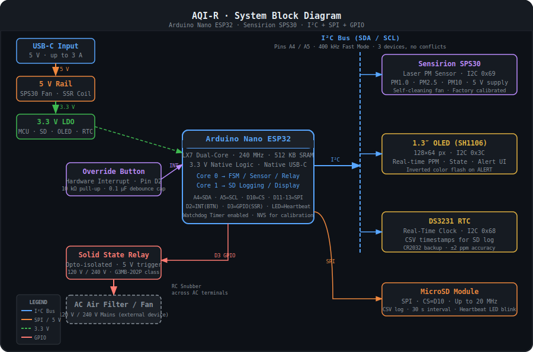
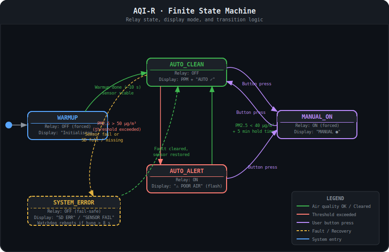

# 🌬️ AQI-R — Air Quality Intelligence & Remediation System

[](LICENSE)
[](https://store.arduino.cc/products/nano-esp32)
[](https://sensirion.com/products/catalog/SPS30/)
[]()
[](CONTRIBUTING.md)

> An automated, data-logging air remediation system that monitors real-time particulate matter levels and physically triggers a relay to run an air filter — logging everything to an SD card with accurate RTC timestamps.

---

## ⚠️ Safety Warning

> **This project switches 120 V / 240 V mains AC electricity through a solid state relay.**
>
> Incorrect wiring of the AC side can cause fire, electric shock, serious injury, or death.
> Always de-energise the AC side before modifying wiring. If you are not comfortable working
> with mains voltage, use a pre-enclosed smart relay module (e.g., PowerSwitch Tail II) and
> never expose bare AC terminals.
>
> See [`docs/SAFETY.md`](docs/SAFETY.md) for detailed guidance.

---

## ✨ Features

| Feature | Detail |
|---|---|
| **PM Sensing** | Sensirion SPS30 — laser scattering, reports PM1.0 / PM2.5 / PM10 |
| **Auto Remediation** | Relay fires when PM2.5 > configurable threshold (default 50 μg/m³) |
| **Hysteresis** | Relay clears only when PM2.5 < 40 μg/m³ sustained for 5 min — prevents chatter |
| **Manual Override** | Hardware interrupt button, toggles MANUAL_ON state, bypasses all AQI logic |
| **OLED Display** | Real-time PPM, system state, SD heartbeat icon; inverted color flash on ALERT |
| **SD Logging** | CSV log every 30 s with accurate DS3231 RTC timestamps |
| **Failsafe FSM** | Finite State Machine; sensor dropout forces relay OFF and SYSTEM_ERROR state |
| **Watchdog Timer** | Hardware WDT — reboots system if SD write hangs > 8 s |
| **USB-C Powered** | Clean single-cable power; no wall-wart or barrel jack |

---

## 📐 System Architecture

The system is organised into four logical layers:

```
┌─────────────────────────────────────────────────────┐
│  Sensing Layer       Sensirion SPS30 (I²C 0x69)     │
│  Control Layer       Arduino Nano ESP32 + FSM        │
│  Output Layer        SSR Relay → AC Air Filter       │
│  Data Layer          DS3231 RTC + MicroSD CSV log    │
└─────────────────────────────────────────────────────┘
```



### Communication Buses

| Bus | Pins | Speed | Devices |
|-----|------|-------|---------|
| I²C | A4 (SDA) / A5 (SCL) | 400 kHz | SPS30 (0x69) · OLED (0x3C) · DS3231 (0x68) |
| SPI | D11 / D12 / D13 / D10 (CS) | 20 MHz | MicroSD card |
| GPIO | D3 (out) | — | SSR Relay trigger |
| GPIO INT | D2 (in) | — | Manual override button |

### Dual-Core Task Split

- **Core 0** — FSM, sensor polling (1 s cycle), relay control, display update
- **Core 1** — SD card logging (30 s cycle), file open/write/flush/close

> Separating IO-heavy SD writes onto Core 1 ensures the relay and display on Core 0
> remain responsive even during a slow SD write cycle.

---

## 🔄 Finite State Machine



| State | Relay | Display | Entry Condition |
|-------|-------|---------|-----------------|
| `WARMUP` | OFF (forced) | "Initialising…" | Power-on / reboot |
| `AUTO_CLEAN` | OFF | PPM value + "AUTO ✓" | Warmup complete, PM2.5 ≤ threshold |
| `AUTO_ALERT` | **ON** | "⚠ POOR AIR" (flashing) | PM2.5 > 50 μg/m³ |
| `MANUAL_ON` | **ON** (forced) | "MANUAL ●" | Button press from any main state |
| `SYSTEM_ERROR` | OFF (fail-safe) | "SD ERR" or "SENSOR FAIL" | Sensor dropout / SD card failure |

**Hysteresis rule:**  `ON` threshold = 50 μg/m³ · `OFF` threshold = 40 μg/m³ + 5 min hold

---

## 🗃️ Bill of Materials

See [`hardware/BOM.csv`](hardware/BOM.csv) for a machine-readable version.

| # | Component | Part / Specification | Qty | Est. Cost (USD) |
|---|-----------|---------------------|-----|-----------------|
| 1 | MCU | Arduino Nano ESP32 | 1 | ~$20 |
| 2 | PM Sensor | Sensirion SPS30 | 1 | ~$45 |
| 3 | Display | 1.3" I²C OLED SH1106 128×64 | 1 | ~$8 |
| 4 | SD Module | MicroSD SPI breakout | 1 | ~$3 |
| 5 | RTC | DS3231 module with CR2032 socket | 1 | ~$5 |
| 6 | Relay | Solid State Relay, 5 V trigger, ≥2 A AC (e.g. Omron G3MB-202P) | 1 | ~$8 |
| 7 | LDO Reg. | AMS1117-3.3 or LD1117V33 (dedicated 3.3 V for SD) | 1 | ~$1 |
| 8 | Button | 6 mm tactile momentary push button | 1 | ~$0.50 |
| 9 | Resistor | 10 kΩ, 1/4 W (button pull-up) | 1 | ~$0.10 |
| 10 | Cap | 0.1 μF ceramic (button debounce) | 1 | ~$0.10 |
| 11 | Cap | 100 μF electrolytic, ≥10 V (SD power rail) | 1 | ~$0.30 |
| 12 | Cap | 0.1 μF ceramic (SD decoupling) | 1 | ~$0.10 |
| 13 | Snubber | 100 Ω + 0.1 μF / 250 V (RC snubber across relay AC output) | 1 | ~$1 |
| 14 | MicroSD | Class 10, FAT32 formatted, ≤32 GB | 1 | ~$8 |
| 15 | Battery | CR2032 coin cell (DS3231 backup) | 1 | ~$1.50 |
| 16 | Enclosure | ABS project box, ≥100×60×35 mm | 1 | ~$10 |
| | | | **Total** | **~$112** |

> Prices are approximate 2025 single-unit retail. Bulk or sourcing from LCSC/AliExpress will
> reduce costs significantly.

---

## 📌 Pin Map

| Arduino Nano ESP32 Pin | Connected To | Direction | Notes |
|------------------------|-------------|-----------|-------|
| A4 (SDA) | SPS30 SDA, OLED SDA, DS3231 SDA | Bidirectional | I²C bus |
| A5 (SCL) | SPS30 SCL, OLED SCL, DS3231 SCL | Bidirectional | I²C bus |
| D10 | SD CS | Output | SPI chip-select |
| D11 (MOSI) | SD MOSI | Output | SPI data |
| D12 (MISO) | SD MISO | Input | SPI data |
| D13 (SCK) | SD SCK | Output | SPI clock |
| D2 | Override button (via 10 kΩ pull-up) | Input (INT) | Hardware interrupt |
| D3 | SSR relay trigger | Output | Active HIGH |
| 5V | SPS30 VCC, SSR trigger + | Supply | SPS30 requires 5 V |
| 3.3V (LDO out) | OLED VCC, SD VCC, DS3231 VCC | Supply | Dedicated LDO |
| GND | All GND rails | Common | — |

---

## 📁 Repository Structure

```
AQI-R/
├── assets/
│   ├── block_diagram.svg      ← System block diagram
│   └── state_machine.svg      ← FSM state/transition diagram
├── docs/
│   ├── DESIGN.md              ← Theory of operation & design rationale
│   ├── POWER_ARCHITECTURE.md  ← Power budget, LDO choice, decoupling
│   ├── SAFETY.md              ← Mains voltage safety guidance
│   └── STATE_MACHINE.md       ← Detailed FSM documentation
├── hardware/
│   ├── BOM.csv                ← Machine-readable bill of materials
│   └── BOM.md                 ← Human-readable BOM with sourcing notes
├── src/                       ← Firmware (to be added)
│   └── .gitkeep
├── .gitignore
├── CONTRIBUTING.md
├── LICENSE
└── README.md
```

---

## 🚀 Getting Started

1. Clone this repository
2. Open `src/AQI_R.ino` in the Arduino IDE (or PlatformIO)
3. Install required libraries (will be listed in `src/README.md`)
4. Wire hardware per the pin map above
5. Flash to Arduino Nano ESP32 via USB-C
6. Insert formatted MicroSD card, set RTC time on first boot
7. Monitor serial output at 115200 baud for diagnostics

---

## 🤝 Contributing

Contributions are welcome! See [CONTRIBUTING.md](CONTRIBUTING.md) for guidelines.

If you build this project, please open a Discussion and share your results — especially if you
have suggestions on enclosure design, sensor placement, or alternative component choices.

---

## 📄 License

This project is licensed under the **MIT License** — see [LICENSE](LICENSE) for details.

Hardware design intent (schematics, BOM, diagrams) is released under
[CERN-OHL-P v2](https://ohwr.org/cern_ohl_p_v2.txt) (permissive open hardware licence).

---

*Built with care. Document the fails. Share the builds.*
